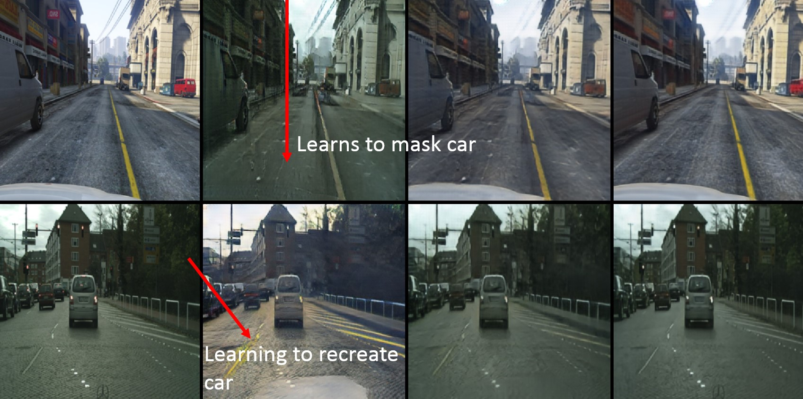
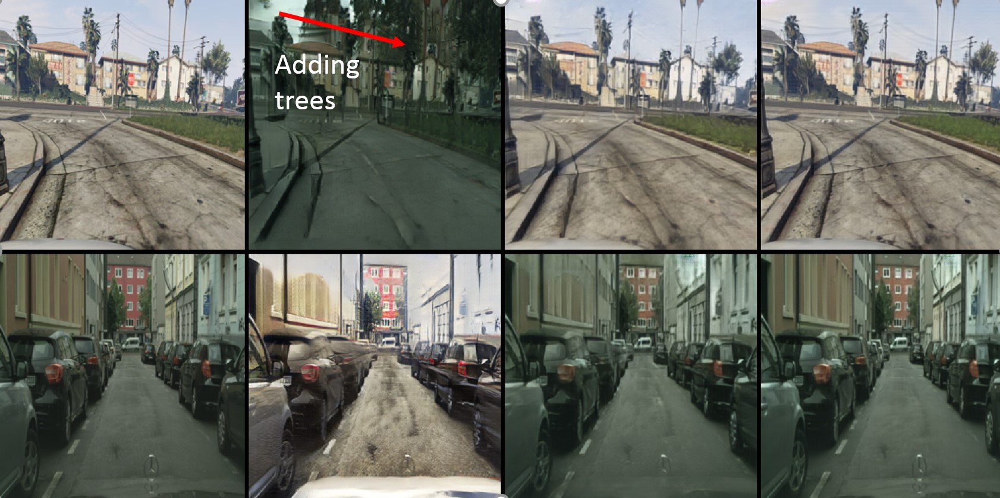
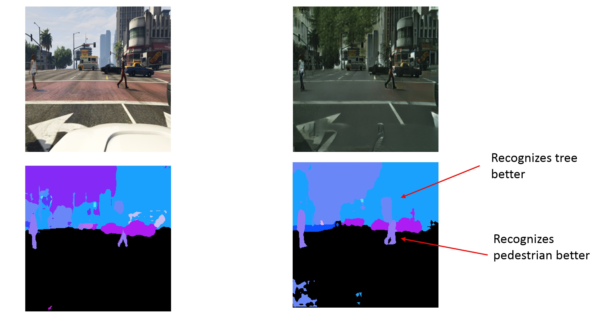
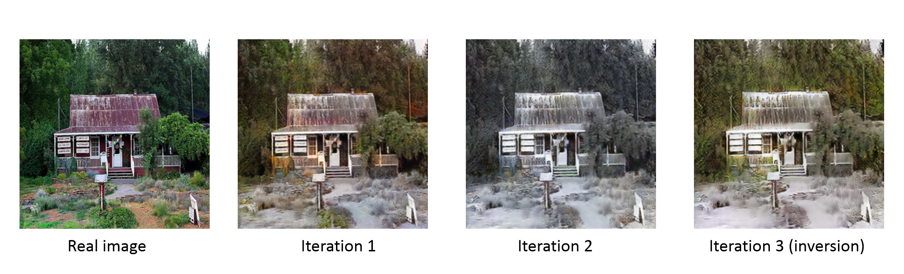

# Domain Adaptation using CycleGAN and Multi-iterative CycleGAN

## Problem Statement
Simulation environments are being widely used for training intelligent agents for different tasks like 
autonomous driving, robotic hand manipulation, robotic navigation and for many other reinforcement learning and supervised learning tasks. Even though these simulation environments expedite the training process, the domain gap between the real-world distribution and the simulated distribution is significant. 
<br>
CycleGANs have the potential of reducing this domain gap by mapping the simulated images to real-world images. The tight constraint which the cyclic loss in CycleGANs provide ensures that the domain adapted image would keep the characteristics and structure of the original simulated image. This technique can then further be combined with noise-reduction techniques and other domain adaptation techniques to improve the results. 
<br>
Additionally, this repository also contains a Multi-iterative CycleGAN architecture which can be used to enhance the output produced by normal CycleGAN and also can be used to understand the behavior of the generator. (Example - In case of Summer to Winter dataset, the generator is learning to invert the colors (green to white and white to green) depending on the shade of the colors.) The multi-iterative CycleGAN present in this repository can be used with any dataset. 

## Input and Output 
The input to the model is an image (image in the original domain) and the output is also an image (image in the adapted domain). 

## Getting Started 
### Installation 
* Clone the repository 
```
git clone https://github.com/Omkar-Ranadive/Domain-Adaptation-CycleGAN
```
* Install Pytorch and torchvision by following the instructions given on their [website.](https://pytorch.org/get-started/locally/)
* Install the remaining dependencies by going into the project directory and running the following command: 
```
pip install -r requirements.txt
```

### Training the model 
* Open a separate terminal window with the same environment activated and start the visdom server by typing `python -m visdom.server`. Live training process can be viewed by navigating to `http://localhost:8097/`. 
* The training data can be downloaded from [here.](https://drive.google.com/file/d/1fd-w_ywnwFg2mZllALTXtoN-EeXBaTr7/view?usp=sharing). Note: This data is a subset of [GTA5](http://efrosgans.eecs.berkeley.edu/cyclegta/gta.zip) dataset and the [Cityscapes](https://www.cityscapes-dataset.com/) dataset.
* Go to the `Domain-Adaptation-CycleGAN/datasets` folder and extract the sim2real.zip file downloaded in the previous step. 
* Go back to the top of project folder `Domain-Adaptation-CycleGAN` and run the following command: 
```
python train_sim.py --dataroot ./datasets/sim2real --name s2r --model cycle_gan --carData True --continue_train
```
* Note: The pretrained models are provided with this repository, so training can be continued from that point onwards. In case you want to start training from scratch, remove the --continue_train parameter while running the train_sim.py file. 

### Testing the model 
**Testing domain adaptation results:**<br> 
```
python iterative_output.py --dataroot ./datasets/sim2real --name=s2r --model=test --no_dropout --carData True --iterations 1 --num_test 130 
```
The generated results can be viewed in `Domain-Adaptation-CycleGAN/results/s2r/test_latest/images` folder. <br>

**Testing multi-iterative CycleGAN results:**<br>
```
python iterative_output.py --dataroot ./datasets/summer2winter_yosemite --name=s2w_iterative --model=test --no_dropout --iterations 3 --num_test 50
```
Note: The testing images for summer2winter are provided with the repository so the aforementioned command can be executed directly. However, if needed, the full summer2winter dataset can be downloaded from [here.](https://people.eecs.berkeley.edu/~taesung_park/CycleGAN/datasets/summer2winter_yosemite.zip)

The generated results can be viewed in the `Domain-Adaptation-CycleGAN/results/s2w_iterative/test_latest/images` folder. <br>

**Performing image segmentation on domain adaptation results [optional]**
* Navigate to `Domain-Adaptation-CycleGAN/Segmentation` 
* Run the file seg_test.py by typing `python seg_test.py`
* Segmentation results would be generated in the `./Segmentation/results/real` and the `./Segmentation/results/sim` folder. 
* A video file of the results can be generated by running `python video_maker.py`. **Only works if the correct video codecs are installed.**

## Results 
### Epoch 26 of training process

<br>

### Epoch 64 of training process

<br>

### Segmentation results on test set 


### Multi-iterative CycleGAN result for enhancing "winter" effect


## References 
* Original CycleGAN repository: https://github.com/junyanz/pytorch-CycleGAN-and-pix2pix
* CycleGAN paper: https://arxiv.org/pdf/1703.10593.pdf
